# BreadKit Technical Specification

## Table of Contents
1. [Introduction](#introduction)
2. [Problem Statement](#problem-statement)
3. [Background](#background)
4. [System Architecture](#system-architecture)
5. [Core Modules](#core-modules)
6. [Sequence Diagrams](#sequence-diagrams)

---

## Introduction

The Breadchain Crowdstaking Application is a smart contract system on Gnosis Chain that accepts users' xDAI and converts it into sDAI (yield-bearing stablecoins). In exchange, stakers receive BREAD tokens minted at a 1:1 ratio with their collateralized xDAI. All interest earned on the sDAI funds the Breadchain Cooperative and its yield recipients through monthly democratic voting by BREAD holders.

This system functions as both a fundraising engine and a post-capitalist credit union, where BREAD acts as a local currency within the ecosystem while enabling transparent participatory budgeting. Token holders vote in 30-day cycles to determine how yield is distributed among yield recipients including the Crypto Commons Association, ReFi DAO, Citizen Wallet, Labor DAO, Symbiota Coop, and the Breadchain treasury.

The protocol is actively deployed at [app.breadchain.xyz](https://app.breadchain.xyz), with implementation details available on [ValueVerse](https://app.valueverse.ai/tokens/bread?tab=implementation-details). This technical specification outlines the architecture, components, and workflows that enable this solidarity primitive for democratic resource allocation.

---

## Background

### Context
BreadKit is an open-source economic primitive that enables any community, cooperative, or organization to deploy their own yield-bearing token system with built-in democratic governance. Rather than requiring communities to build complex DeFi infrastructure from scratch, BreadKit provides a ready-to-deploy toolkit that transforms traditional crowdfunding into a sustainable, participatory economic model.

The protocol emerged from the recognition that cooperative economics shouldn't be limited to those with deep technical expertise. By packaging yield generation, democratic distribution, and governance mechanisms into a reusable primitive, BreadKit democratizes access to post-capitalist economic tools that any group can leverage for their collective goals.

### Key Concepts

**Yield Distribution**: The protocol accumulates yield from various sources (staking, fees, etc.) and distributes it to designated yield recipients based on community voting.

**Voting Power**: Users' influence in the distribution process is determined by their token holdings over time, encouraging long-term alignment.

**Cycle-Based Operations**: The system operates in fixed-length cycles (measured in blocks), providing predictable distribution schedules while allowing for regular reallocation of resources.

### Design Principles

1. **Accessibility**: Any community can deploy and customize their own instance
2. **Decentralization**: No single entity controls yield distribution
3. **Transparency**: All votes and distributions are on-chain and auditable
4. **Flexibility**: Support for adding/removing yield recipients and adjusting parameters
5. **Incentive Alignment**: Rewards for consistent participation
6. **Upgradeability**: Protocol can evolve through governance decisions

---

## Problem Statement

Communities seeking to create their own decentralized economic systems face significant barriers:

1. **High Technical Complexity**: Building a yield-bearing token primitive requires deep smart contract expertise, making it inaccessible for most communities without specialized blockchain developers.

2. **Infrastructure Requirements**: Communities must independently develop and maintain complex infrastructure including yield generation mechanisms, distribution systems, and governance frameworks.

3. **Governance Implementation Barriers**: Implementing fair, democratic distribution mechanisms that align incentives and encourage participation requires complex voting systems and participation tracking.

The BreadKit protocol addresses these challenges by providing a reusable, community-adaptable bread primitive that enables any community to easily launch their own yield-bearing token with built-in democratic distribution and governance capabilities.

---

## System Architecture

The BreadKit protocol follows a modular architecture designed for flexibility, upgradeability, and composability. Each module operates independently while integrating seamlessly through well-defined interfaces.

### Architecture Overview

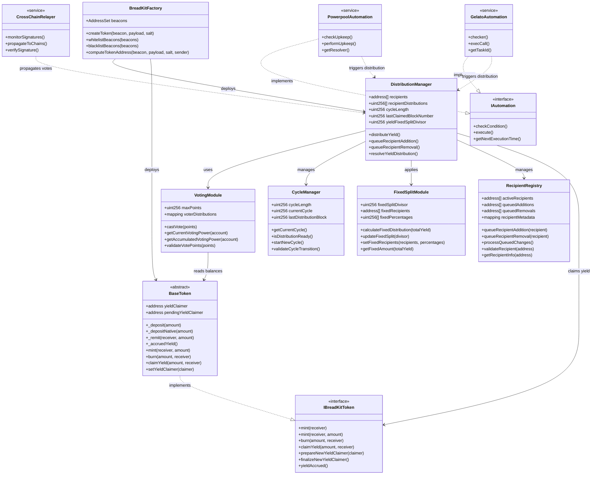
```mermaid
classDiagram
    class DistributionManager {
        +address[] recipients
        +uint256[] recipientDistributions
        +uint256 cycleLength
        +uint256 lastClaimedBlockNumber
        +uint256 yieldFixedSplitDivisor
        +distributeYield()
        +queueRecipientAddition()
        +queueRecipientRemoval()
        +resolveYieldDistribution()
    }
    
    class VotingModule {
        +uint256 maxPoints
        +mapping voterDistributions
        +castVote(points)
        +getCurrentVotingPower(account)
        +getAccumulatedVotingPower(account)
        +validateVotePoints(points)
    }
    
    class CycleManager {
        +uint256 cycleLength
        +uint256 currentCycle
        +uint256 lastDistributionBlock
        +getCurrentCycle()
        +isDistributionReady()
        +startNewCycle()
        +validateCycleTransition()
    }
    
    class FixedSplitModule {
        +uint256 fixedSplitDivisor
        +address[] fixedRecipients
        +uint256[] fixedPercentages
        +calculateFixedDistribution(totalYield)
        +updateFixedSplit(divisor)
        +setFixedRecipients(recipients, percentages)
        +getFixedAmount(totalYield)
    }
    
    class RecipientRegistry {
        +address[] activeRecipients
        +address[] queuedAdditions
        +address[] queuedRemovals
        +mapping recipientMetadata
        +queueRecipientAddition(recipient)
        +queueRecipientRemoval(recipient)
        +processQueuedChanges()
        +validateRecipient(address)
        +getRecipientInfo(address)
    }
    
    
    class BaseToken {
        <<abstract>>
        +address yieldClaimer
        +address pendingYieldClaimer
        +_deposit(amount)
        +_depositNative(amount)
        +_remit(receiver, amount)
        +_accruedYield()
        +mint(receiver, amount)
        +burn(amount, receiver)
        +claimYield(amount, receiver)
        +setYieldClaimer(claimer)
    }
    
    class IBreadKitToken {
        <<interface>>
        +mint(receiver)
        +mint(receiver, amount)
        +burn(amount, receiver)
        +claimYield(amount, receiver)
        +prepareNewYieldClaimer(claimer)
        +finalizeNewYieldClaimer()
        +yieldAccrued()
    }
    
    class BreadKitFactory {
        +AddressSet beacons
        +createToken(beacon, payload, salt)
        +whitelistBeacons(beacons)
        +blacklistBeacons(beacons)
        +computeTokenAddress(beacon, payload, salt, sender)
    }
    
    class CrossChainRelayer {
        <<service>>
        +monitorSignatures()
        +propagateToChains()
        +verifySignature()
    }
    
    class IAutomation {
        <<interface>>
        +checkCondition()
        +execute()
        +getNextExecutionTime()
    }
    
    class PowerpoolAutomation {
        <<service>>
        +checkUpkeep()
        +performUpkeep()
        +getResolver()
    }
    
    class GelatoAutomation {
        <<service>>
        +checker()
        +execCall()
        +getTaskId()
    }
    
    DistributionManager --> VotingModule : uses
    DistributionManager --> CycleManager : manages
    DistributionManager --> FixedSplitModule : applies
    DistributionManager --> RecipientRegistry : manages
    DistributionManager --> IBreadKitToken : claims yield
    BaseToken ..|> IBreadKitToken : implements
    VotingModule --> BaseToken : reads balances
    BreadKitFactory --> DistributionManager : deploys
    BreadKitFactory --> BaseToken : deploys
    CrossChainRelayer ..> DistributionManager : propagates votes
    PowerpoolAutomation ..|> IAutomation : implements
    GelatoAutomation ..|> IAutomation : implements
    PowerpoolAutomation ..> DistributionManager : triggers distribution
    GelatoAutomation ..> DistributionManager : triggers distribution
```

---

## Core Modules

### Token Module
**Purpose**: Manages token economics and staking mechanisms

**Problem Statement**: Communities need a way to create yield-bearing tokens that represent both governance power and economic value. Traditional token systems either lack yield generation capabilities or require complex integrations with multiple DeFi protocols. Additionally, managing yield claims securely while preventing unauthorized access to accumulated yield presents significant security challenges.

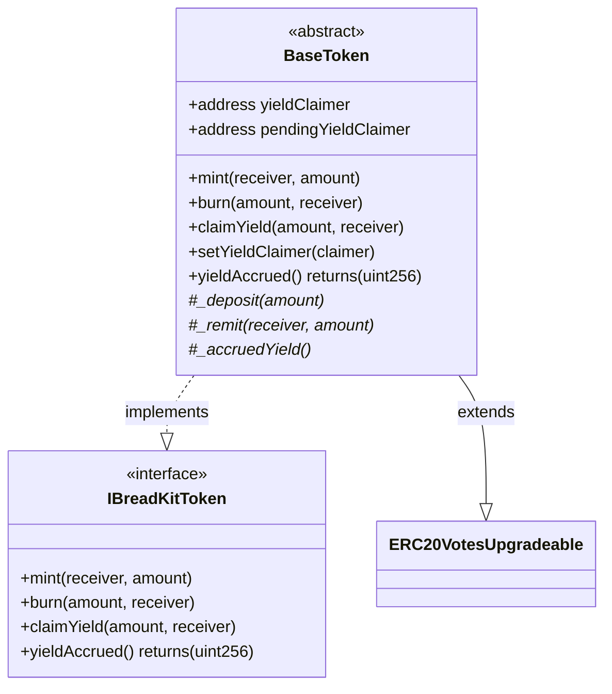
```mermaid
classDiagram
    class BaseToken {
        <<abstract>>
        +address yieldClaimer
        +address pendingYieldClaimer
        +mint(receiver, amount)
        +burn(amount, receiver)
        +claimYield(amount, receiver)
        +setYieldClaimer(claimer)
        +yieldAccrued() returns(uint256)
        #_deposit(amount)*
        #_remit(receiver, amount)*
        #_accruedYield()*
    }
    
    class IBreadKitToken {
        <<interface>>
        +mint(receiver, amount)
        +burn(amount, receiver)
        +claimYield(amount, receiver)
        +yieldAccrued() returns(uint256)
    }
    
    BaseToken ..|> IBreadKitToken : implements
    BaseToken --|> ERC20VotesUpgradeable : extends
```

**Components**:
- **Crowdstaking Contract**: Converts collateral to yield source, mints BreadKit tokens 1:1
- **BreadKit Token**: ERC20 governance token with voting capabilities
- **Off-chain Relayer**: Monitors signatures on one chain and submits to other BreadKit instances

**Features**:
- 1:1 minting ratio with collateralized assets
- Yield-bearing asset integration
- Vote delegation and snapshot capabilities
- Time-weighted voting power accumulation

**Functional Requirements:**
- MUST implement ERC20 standard with voting capabilities
- MUST support 1:1 minting ratio with collateral
- MUST track yield accumulation separately from principal
- MUST allow yield claiming by authorized claimer only
- MUST support both ERC20 and native token deposits

**Technical Requirements:**
- Abstract base contract for extensibility
- Integration with yield-bearing protocols (e.g., sDAI)
- Two-step yield claimer updates for safety
- Event emission for all state changes

**Workflow:**

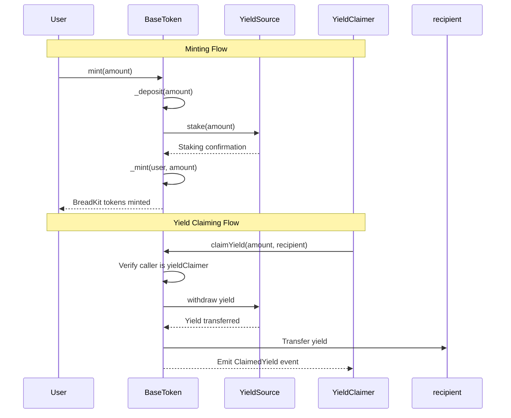
```mermaid
sequenceDiagram
    participant User
    participant BaseToken
    participant YieldSource
    participant YieldClaimer

    Note over User, YieldClaimer: Minting Flow
    User->>BaseToken: mint(amount)
    BaseToken->>BaseToken: _deposit(amount)
    BaseToken->>YieldSource: stake(amount)
    YieldSource-->>BaseToken: Staking confirmation
    BaseToken->>BaseToken: _mint(user, amount)
    BaseToken-->>User: BreadKit tokens minted

    Note over User, YieldClaimer: Yield Claiming Flow
    YieldClaimer->>BaseToken: claimYield(amount, recipient)
    BaseToken->>BaseToken: Verify caller is yieldClaimer
    BaseToken->>YieldSource: withdraw yield
    YieldSource-->>BaseToken: Yield transferred
    BaseToken->>recipient: Transfer yield
    BaseToken-->>YieldClaimer: Emit ClaimedYield event
```

### Voting Module
**Purpose**: Handles all voting operations and power calculations with signature-based gasless voting

**Problem Statement**: Democratic resource allocation requires a fair voting system that accurately represents community member participation. Key challenges include preventing vote manipulation, ensuring votes are weighted appropriately based on token holdings, managing vote changes within cycles, enabling gasless voting through signatures, and integrating various incentive mechanisms without compromising the integrity of the voting process.

**📚 Documentation**: See [VotingModuleSignatures.md](documentation/VotingModuleSignatures.md) for detailed signature generation examples and implementation guidance.

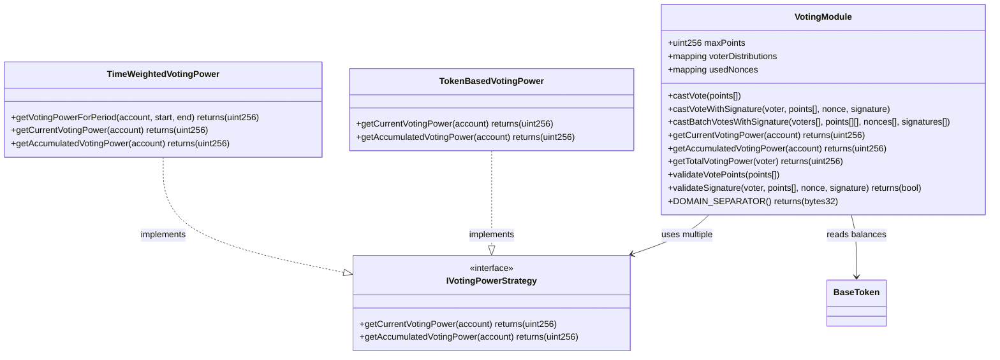
```mermaid
classDiagram
    class VotingModule {
        +uint256 maxPoints
        +mapping voterDistributions
        +mapping usedNonces
        +castVote(points[])
        +castVoteWithSignature(voter, points[], nonce, signature)
        +castBatchVotesWithSignature(voters[], points[][], nonces[], signatures[])
        +getCurrentVotingPower(account) returns(uint256)
        +getAccumulatedVotingPower(account) returns(uint256)
        +getTotalVotingPower(voter) returns(uint256)
        +validateVotePoints(points[])
        +validateSignature(voter, points[], nonce, signature) returns(bool)
        +DOMAIN_SEPARATOR() returns(bytes32)
    }
    
    class IVotingPowerStrategy {
        <<interface>>
        +getCurrentVotingPower(account) returns(uint256)
        +getAccumulatedVotingPower(account) returns(uint256)
    }
    
    class TokenBasedVotingPower {
        +getCurrentVotingPower(account) returns(uint256)
        +getAccumulatedVotingPower(account) returns(uint256)
    }
    
    class TimeWeightedVotingPower {
        +getVotingPowerForPeriod(account, start, end) returns(uint256)
        +getCurrentVotingPower(account) returns(uint256)
        +getAccumulatedVotingPower(account) returns(uint256)
    }
    
    VotingModule --> IVotingPowerStrategy : uses multiple
    VotingModule --> BaseToken : reads balances
    TokenBasedVotingPower ..|> IVotingPowerStrategy : implements
    TimeWeightedVotingPower ..|> IVotingPowerStrategy : implements
```

**Components**:
- **Vote Casting**: Process user votes with point allocation
- **Power Calculator**: Computes voting power from token balances
- **Signature Verifier**: Validates EIP-712 signatures for gasless voting
- **Strategy Manager**: Aggregates voting power from multiple sources

**Features**:
- Point-based voting system with validation
- **EIP-712 signature-based gasless voting** (see [documentation/VotingModuleSignatures.md](documentation/VotingModuleSignatures.md))
- **Batch voting operations for gas efficiency**
- **Flexible nonce management (allows skipping)**
- Multi-source voting power calculation via strategies
- Vote recasting within active cycles
- Historical voting power tracking
- Vote point validation and distribution
- Meta-transaction support for true gasless voting

**Functional Requirements:**
- MUST allow users to allocate voting points to recipients
- MUST validate total points do not exceed maxPoints per recipient
- MUST calculate voting power from token balances
- MUST support vote recasting within same cycle
- MUST verify EIP-712 signatures for gasless voting
- MUST prevent replay attacks via nonce management
- MUST support batch vote submission

**Technical Requirements:**
- Historical voting power tracking via checkpoints
- Support for multiple voting power sources
- Mapping of voter distributions per cycle

**Workflow:**

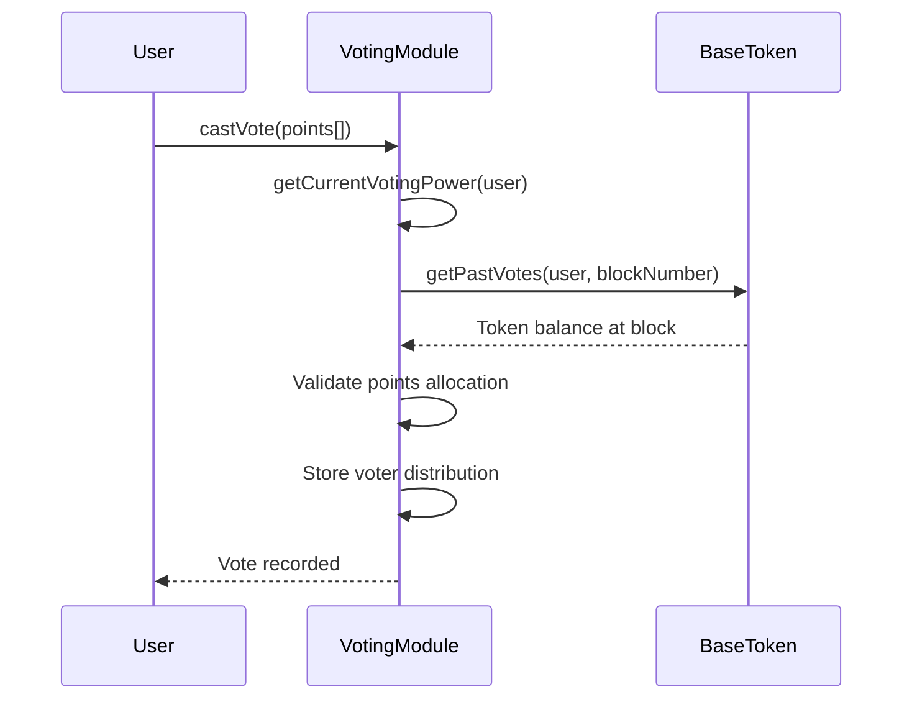
```mermaid
sequenceDiagram
    participant User
    participant VotingModule
    participant BaseToken

    User->>VotingModule: castVote(points[])
    
    VotingModule->>VotingModule: getCurrentVotingPower(user)
    VotingModule->>BaseToken: getPastVotes(user, blockNumber)
    BaseToken-->>VotingModule: Token balance at block
    
    VotingModule->>VotingModule: Validate points allocation
    VotingModule->>VotingModule: Store voter distribution
    VotingModule-->>User: Vote recorded
```

### Voting Process

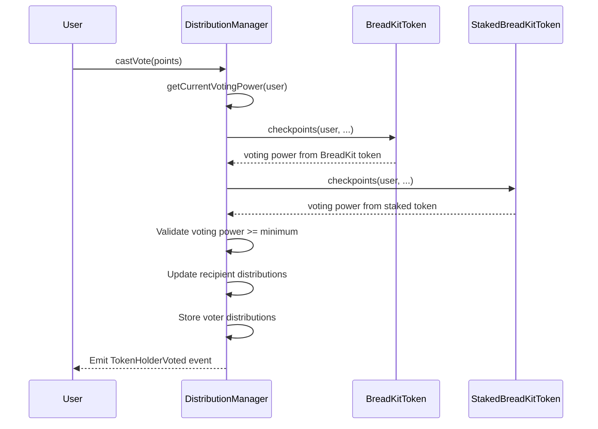
```mermaid
sequenceDiagram
    participant User
    participant DistributionManager
    participant BreadKitToken
    participant StakedBreadKitToken

    User->>DistributionManager: castVote(points)
    DistributionManager->>DistributionManager: getCurrentVotingPower(user)
    
    DistributionManager->>BreadKitToken: checkpoints(user, ...)
    BreadKitToken-->>DistributionManager: voting power from BreadKit token
    
    DistributionManager->>StakedBreadKitToken: checkpoints(user, ...)
    StakedBreadKitToken-->>DistributionManager: voting power from staked token
    
    DistributionManager->>DistributionManager: Validate voting power >= minimum
    DistributionManager->>DistributionManager: Update recipient distributions
    DistributionManager->>DistributionManager: Store voter distributions
    
    DistributionManager-->>User: Emit TokenHolderVoted event
```

**Components**:
- **Vote Casting**: Process user votes with point allocation
- **Power Calculator**: Computes voting power from token balances

**Features**:
- Point-based voting system with validation
- Multi-source voting power calculation
- Vote recasting within active cycles
- Historical voting power tracking
- Vote point validation and distribution

### Cycle Management Module
**Purpose**: Manages distribution cycles and timing

**Problem Statement**: Coordinating periodic yield distributions requires precise timing mechanisms that are deterministic and resistant to manipulation. Without proper cycle management, distributions could be triggered prematurely, skipped entirely, or executed multiple times. The system must ensure predictable distribution schedules while preventing gaming of the timing mechanics.

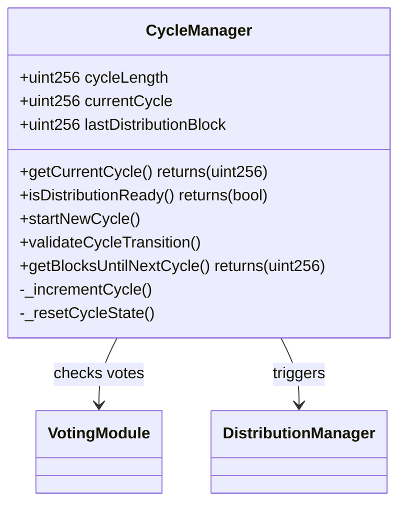
```mermaid
classDiagram
    class CycleManager {
        +uint256 cycleLength
        +uint256 currentCycle
        +uint256 lastDistributionBlock
        +getCurrentCycle() returns(uint256)
        +isDistributionReady() returns(bool)
        +startNewCycle()
        +validateCycleTransition()
        +getBlocksUntilNextCycle() returns(uint256)
        -_incrementCycle()
        -_resetCycleState()
    }
    
    CycleManager --> VotingModule : checks votes
    CycleManager --> DistributionManager : triggers
```

**Components**:
- **Cycle Tracker**: Monitors current cycle and transitions
- **Distribution Scheduler**: Determines when distributions occur
- **State Manager**: Handles cycle state transitions

**Features**:
- 30-day voting cycles with automatic transitions
- Block-based timing for deterministic execution
- Cycle validation and transition logic
- Distribution readiness checks
- Automated cycle resets

**Functional Requirements:**
- MUST track current cycle number and duration
- MUST determine when distributions can occur
- MUST handle cycle transitions automatically
- MUST reset voting state between cycles
- MUST maintain cycle history

**Technical Requirements:**
- Block-based timing for determinism
- Configurable cycle length
- State machine for cycle phases
- Integration with distribution triggers

**Workflow:**

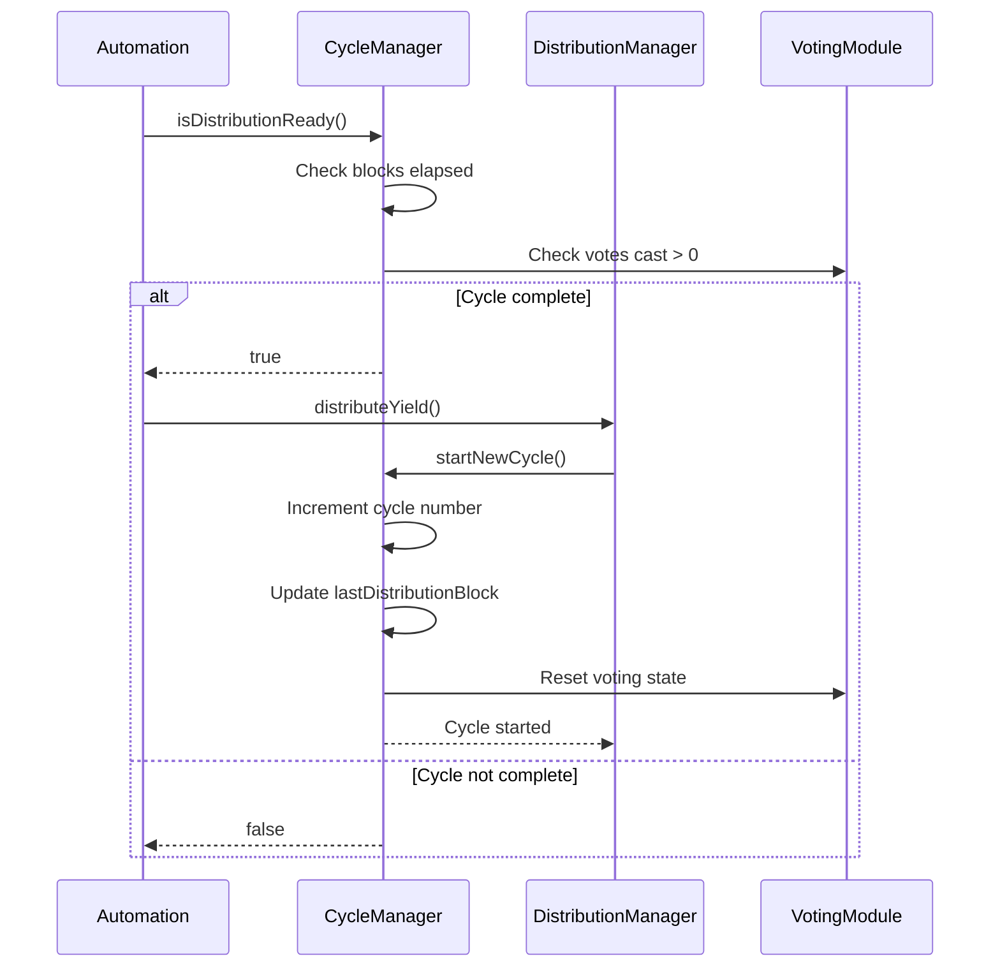
```mermaid
sequenceDiagram
    participant Automation
    participant CycleManager
    participant DistributionManager
    participant VotingModule

    Automation->>CycleManager: isDistributionReady()
    CycleManager->>CycleManager: Check blocks elapsed
    CycleManager->>VotingModule: Check votes cast > 0
    
    alt Cycle complete
        CycleManager-->>Automation: true
        Automation->>DistributionManager: distributeYield()
        DistributionManager->>CycleManager: startNewCycle()
        CycleManager->>CycleManager: Increment cycle number
        CycleManager->>CycleManager: Update lastDistributionBlock
        CycleManager->>VotingModule: Reset voting state
        CycleManager-->>DistributionManager: Cycle started
    else Cycle not complete
        CycleManager-->>Automation: false
    end
```

### Fixed Split Module
**Purpose**: Manages the fixed portion of yield distribution

**Problem Statement**: Many DAOs struggle to balance community-driven allocation with operational necessities. Critical infrastructure, core contributors, and essential services require predictable funding that shouldn't be subject to voting volatility. The challenge is creating a system that guarantees baseline funding for essential recipients while still allowing democratic control over the remaining resources.

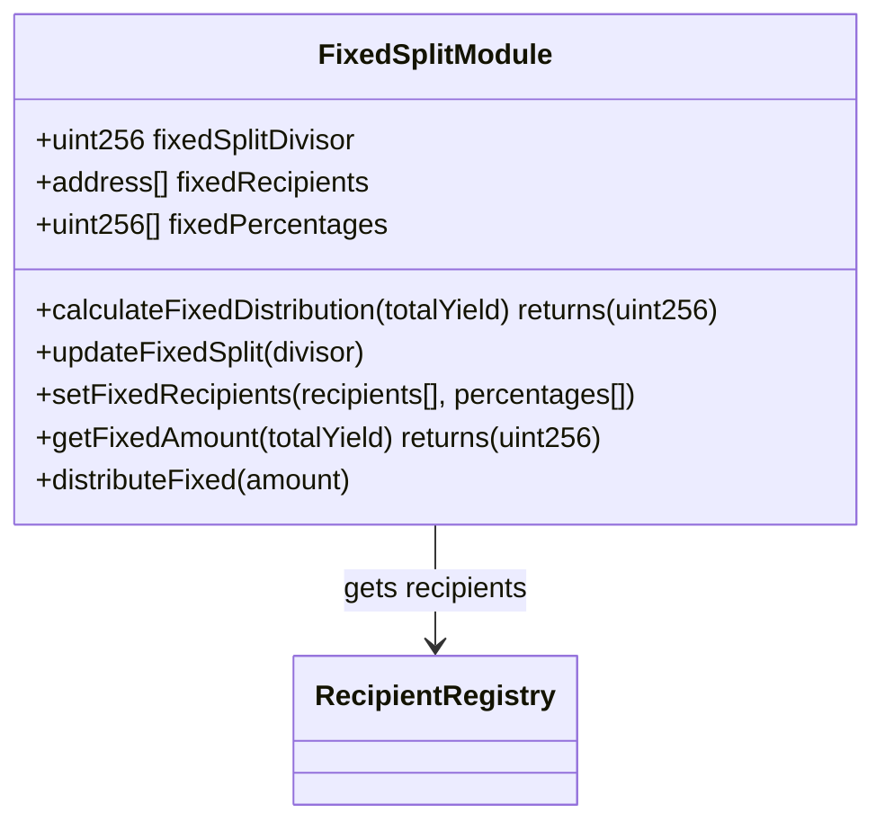
```mermaid
classDiagram
    class FixedSplitModule {
        +uint256 fixedSplitDivisor
        +address[] fixedRecipients
        +uint256[] fixedPercentages
        +calculateFixedDistribution(totalYield) returns(uint256)
        +updateFixedSplit(divisor)
        +setFixedRecipients(recipients[], percentages[])
        +getFixedAmount(totalYield) returns(uint256)
        +distributeFixed(amount)
    }
    
    FixedSplitModule --> RecipientRegistry : gets recipients
```

**Components**:
- **Split Calculator**: Determines fixed vs voted portions
- **Fixed Recipients Manager**: Manages recipients of fixed split
- **Percentage Allocator**: Handles percentage-based distributions

**Features**:
- Configurable split ratio (default 50/50)
- Pre-determined recipient list for fixed portion
- Automatic calculation of fixed distributions
- Support for updating split parameters
- Integration with total yield calculations

**Functional Requirements:**
- MUST calculate fixed portion of total yield
- MUST distribute to predetermined recipients
- MUST support configurable split ratio
- MUST integrate with total distribution flow

**Technical Requirements:**
- Immutable recipient list for fixed portion
- Percentage-based allocation logic
- Integration with DistributionManager
- Validation of split parameters

**Workflow:**

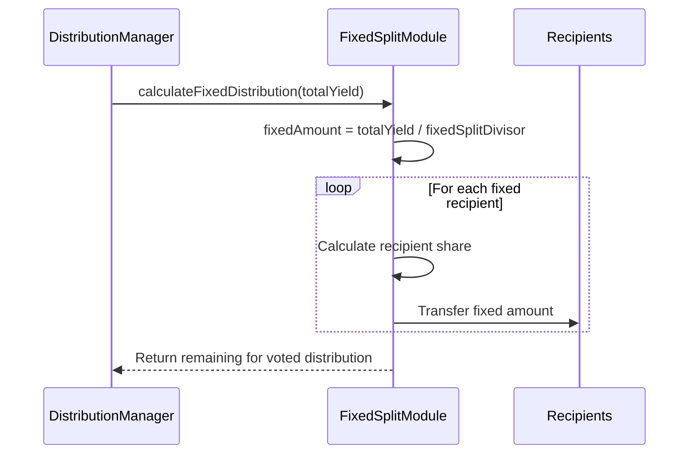
```mermaid
sequenceDiagram
    participant DistributionManager
    participant FixedSplitModule
    participant Recipients

    DistributionManager->>FixedSplitModule: calculateFixedDistribution(totalYield)
    FixedSplitModule->>FixedSplitModule: fixedAmount = totalYield / fixedSplitDivisor
    
    loop For each fixed recipient
        FixedSplitModule->>FixedSplitModule: Calculate recipient share
        FixedSplitModule->>Recipients: Transfer fixed amount
    end
    
    FixedSplitModule-->>DistributionManager: Return remaining for voted distribution
```

### Recipient Registry Module
**Purpose**: Manages yield recipients and their eligibility

**Problem Statement**: Dynamic management of yield recipients poses significant challenges around security and governance. Adding or removing recipients immediately could enable attacks or hasty decisions, while overly restrictive processes could prevent necessary adaptations. The system must balance flexibility with security, ensuring recipient changes are deliberate and transparent while preventing malicious manipulation.

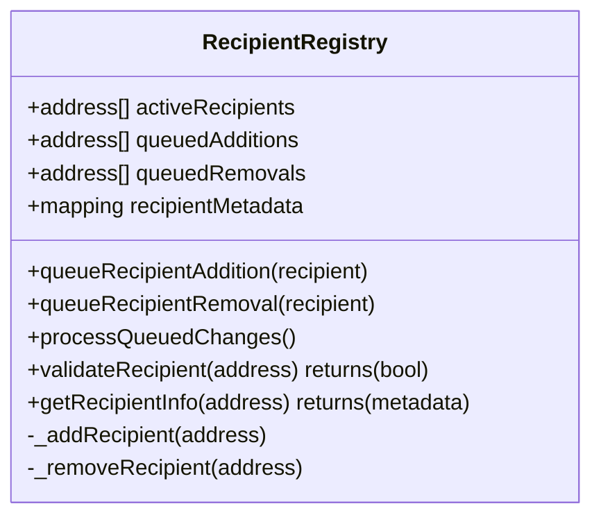
```mermaid
classDiagram
    class RecipientRegistry {
        +address[] activeRecipients
        +address[] queuedAdditions
        +address[] queuedRemovals
        +mapping recipientMetadata
        +queueRecipientAddition(recipient)
        +queueRecipientRemoval(recipient)
        +processQueuedChanges()
        +validateRecipient(address) returns(bool)
        +getRecipientInfo(address) returns(metadata)
        -_addRecipient(address)
        -_removeRecipient(address)
    }
```

**Components**:
- **Registry Manager**: Maintains active recipient list
- **Queue Processor**: Handles pending additions/removals with time delays
- **Metadata Store**: Stores recipient information and status
- **Allocation Tracker**: Records historical distributions

**Features**:
- Queued recipient management with time delays
- Batch processing of recipient changes at cycle end
- Recipient validation and duplicate prevention
- Metadata tracking for each recipient
- Safe removal process with state cleanup
- Queued recipient additions with governance delay
- Distribution history tracking
- Multi-signature approval options

**Functional Requirements:**
- MUST maintain list of eligible recipients
- MUST queue additions/removals for next cycle
- MUST validate recipient addresses
- MUST prevent duplicate recipients
- MUST process queued changes at cycle end

**Technical Requirements:**
- Separate queues for additions and removals
- Batch processing of changes
- Metadata storage per recipient
- Event emission for all changes

**Workflow:**

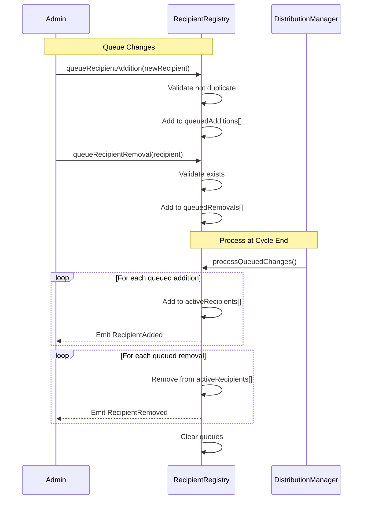
```mermaid
sequenceDiagram
    participant Admin
    participant RecipientRegistry
    participant DistributionManager

    Note over Admin, RecipientRegistry: Queue Changes
    Admin->>RecipientRegistry: queueRecipientAddition(newRecipient)
    RecipientRegistry->>RecipientRegistry: Validate not duplicate
    RecipientRegistry->>RecipientRegistry: Add to queuedAdditions[]
    
    Admin->>RecipientRegistry: queueRecipientRemoval(recipient)
    RecipientRegistry->>RecipientRegistry: Validate exists
    RecipientRegistry->>RecipientRegistry: Add to queuedRemovals[]
    
    Note over RecipientRegistry, DistributionManager: Process at Cycle End
    DistributionManager->>RecipientRegistry: processQueuedChanges()
    
    loop For each queued addition
        RecipientRegistry->>RecipientRegistry: Add to activeRecipients[]
        RecipientRegistry-->>Admin: Emit RecipientAdded
    end
    
    loop For each queued removal
        RecipientRegistry->>RecipientRegistry: Remove from activeRecipients[]
        RecipientRegistry-->>Admin: Emit RecipientRemoved
    end
    
    RecipientRegistry->>RecipientRegistry: Clear queues
```

### Distribution Module
**Purpose**: Handles yield collection and allocation

**Problem Statement**: Executing fair and transparent yield distributions is complex, requiring precise calculations, secure fund transfers, and protection against various attack vectors. Without proper safeguards, distributions could be manipulated through front-running, sandwich attacks, or calculation errors. The system must ensure accurate proportional distributions while maintaining gas efficiency and preventing both accidental and malicious fund loss.

**Components**:
- **Yield Collector**: Aggregates yield from staked positions
- **Distribution Engine**: Calculates and executes fund transfers
- **Split Calculator**: Manages fixed (50%) and voted (50%) allocations

**Features**:
- Automated yield harvesting from yield sources
- Proportional distribution based on votes
- Batch distribution to multiple yield recipients
- Slippage protection and safety checks
- Emergency pause mechanisms

**Workflow:**

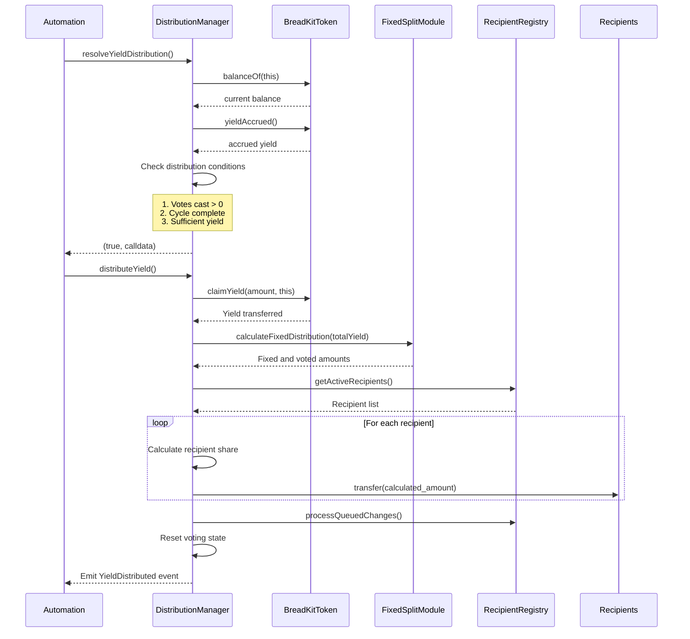
```mermaid
sequenceDiagram
    participant Automation
    participant DistributionManager
    participant BreadKitToken
    participant FixedSplitModule
    participant RecipientRegistry
    participant Recipients

    Automation->>DistributionManager: resolveYieldDistribution()
    DistributionManager->>BreadKitToken: balanceOf(this)
    BreadKitToken-->>DistributionManager: current balance
    DistributionManager->>BreadKitToken: yieldAccrued()
    BreadKitToken-->>DistributionManager: accrued yield
    
    DistributionManager->>DistributionManager: Check distribution conditions
    Note over DistributionManager: 1. Votes cast > 0<br/>2. Cycle complete<br/>3. Sufficient yield
    
    DistributionManager-->>Automation: (true, calldata)
    
    Automation->>DistributionManager: distributeYield()
    DistributionManager->>BreadKitToken: claimYield(amount, this)
    BreadKitToken-->>DistributionManager: Yield transferred
    
    DistributionManager->>FixedSplitModule: calculateFixedDistribution(totalYield)
    FixedSplitModule-->>DistributionManager: Fixed and voted amounts
    
    DistributionManager->>RecipientRegistry: getActiveRecipients()
    RecipientRegistry-->>DistributionManager: Recipient list
    
    loop For each recipient
        DistributionManager->>DistributionManager: Calculate recipient share
        DistributionManager->>Recipients: transfer(calculated_amount)
    end
    
    DistributionManager->>RecipientRegistry: processQueuedChanges()
    DistributionManager->>DistributionManager: Reset voting state
    
    DistributionManager-->>Automation: Emit YieldDistributed event
```

### Automation Module
**Purpose**: Enables autonomous protocol operations through multiple automation providers

**Problem Statement**: Decentralized protocols require reliable automation for critical operations like yield distributions, but depending on a single automation provider creates a central point of failure. Manual execution is error-prone and defeats the purpose of autonomous operation. The challenge is implementing redundant automation systems that ensure timely execution while preventing double-spending and maintaining cost efficiency across different blockchain networks.

**Components**:
- **Automation Interface**: Standard interface for automation providers
- **Powerpool Implementation**: Resolver-based automation using Powerpool network
- **Gelato Implementation**: Task-based automation using Gelato network
- **Distribution Scheduler**: Coordinates yield distributions across providers

**Features**:
- Multi-provider support for redundancy
- Gas-efficient automation checks
- Conditional execution based on cycle state
- Provider-agnostic integration
- Fallback manual execution options
- MEV protection mechanisms

**Workflow:**

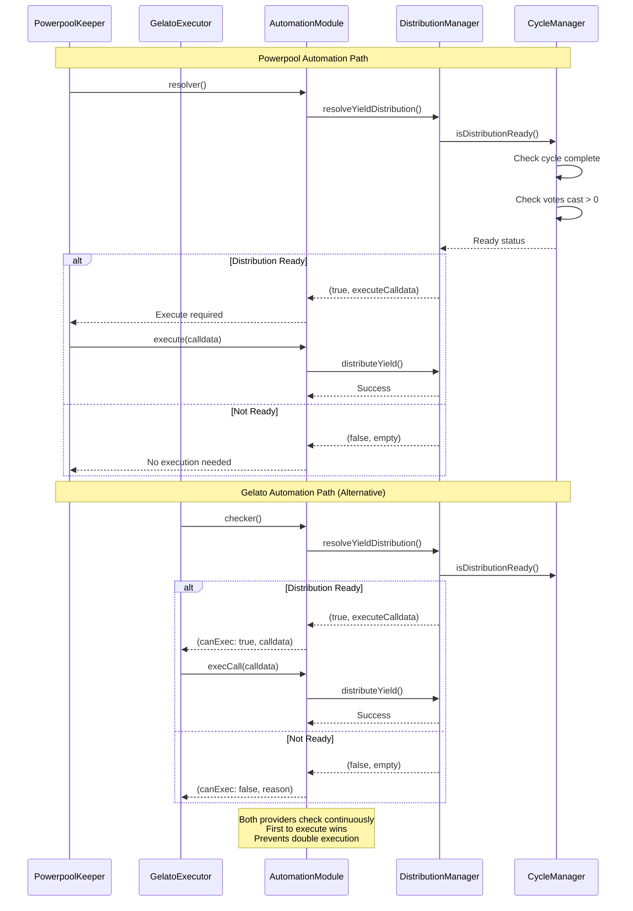
```mermaid
sequenceDiagram
    participant PowerpoolKeeper
    participant GelatoExecutor
    participant AutomationModule
    participant DistributionManager
    participant CycleManager

    Note over PowerpoolKeeper, CycleManager: Powerpool Automation Path
    
    PowerpoolKeeper->>AutomationModule: resolver()
    AutomationModule->>DistributionManager: resolveYieldDistribution()
    DistributionManager->>CycleManager: isDistributionReady()
    CycleManager->>CycleManager: Check cycle complete
    CycleManager->>CycleManager: Check votes cast > 0
    CycleManager-->>DistributionManager: Ready status
    
    alt Distribution Ready
        DistributionManager-->>AutomationModule: (true, executeCalldata)
        AutomationModule-->>PowerpoolKeeper: Execute required
        PowerpoolKeeper->>AutomationModule: execute(calldata)
        AutomationModule->>DistributionManager: distributeYield()
        DistributionManager-->>AutomationModule: Success
    else Not Ready
        DistributionManager-->>AutomationModule: (false, empty)
        AutomationModule-->>PowerpoolKeeper: No execution needed
    end

    Note over PowerpoolKeeper, CycleManager: Gelato Automation Path (Alternative)
    
    GelatoExecutor->>AutomationModule: checker()
    AutomationModule->>DistributionManager: resolveYieldDistribution()
    DistributionManager->>CycleManager: isDistributionReady()
    
    alt Distribution Ready
        DistributionManager-->>AutomationModule: (true, executeCalldata)
        AutomationModule-->>GelatoExecutor: (canExec: true, calldata)
        GelatoExecutor->>AutomationModule: execCall(calldata)
        AutomationModule->>DistributionManager: distributeYield()
        DistributionManager-->>AutomationModule: Success
    else Not Ready
        DistributionManager-->>AutomationModule: (false, empty)
        AutomationModule-->>GelatoExecutor: (canExec: false, reason)
    end

    Note over AutomationModule: Both providers check continuously<br/>First to execute wins<br/>Prevents double execution
```
